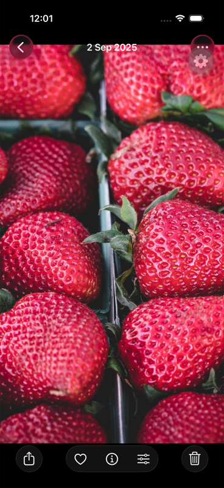
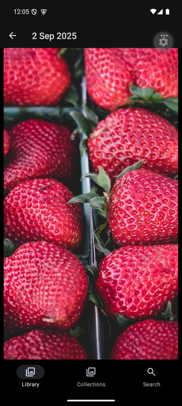
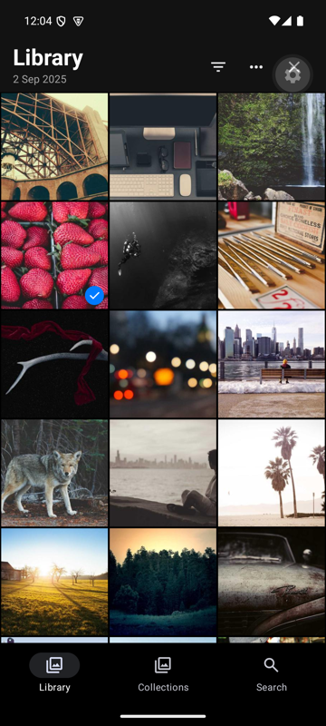

# Photos screen screenshots

The Photos sub-app (embedded from `expo-live-stream`) running in the demo, on
iPhone 17 Pro (iOS 26) and Pixel 7 (API 35).

| | iOS | Android |
|---|---|---|
| Home menu (Photos row) |  |  |
| Library (tab bar + grid) |  |  |
| Photo detail |  |  |

On iOS the photo detail uses the iOS 26 glass bottom toolbar (Share / Favorite /
Info / Adjust / Delete) and a transparent large-title header; both are iOS-only,
so Android falls back to the default Material app bar.

## Improvements

Theme-aware backdrop — the photo detail now follows light/dark instead of a
fixed white background (shown here in dark mode), and long-press on a cell enters
select mode with a haptic on Android.

| iOS detail (dark) | Android detail (dark) | Android select mode |
|---|---|---|
|  |  |  |
